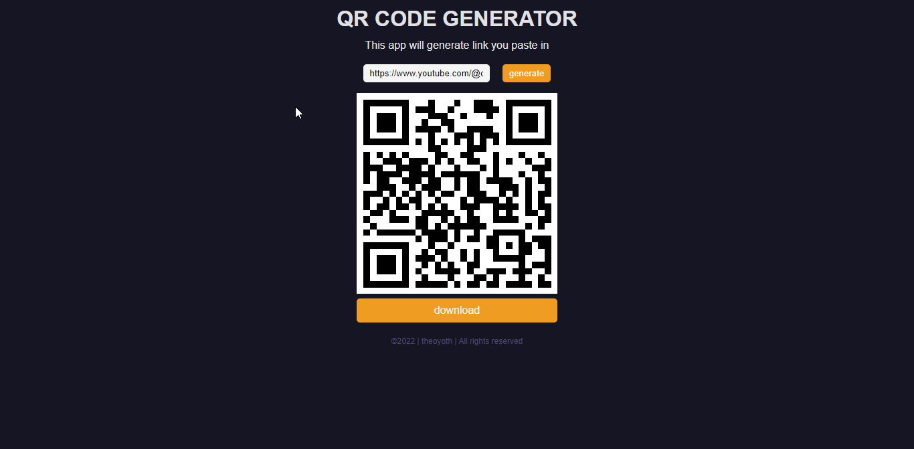
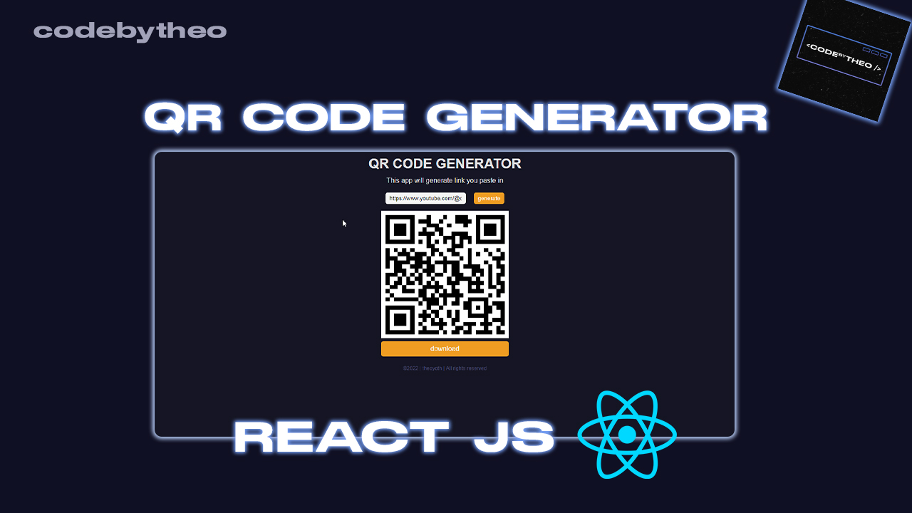

## Project Setup

clone this repository and ...

```bash
# install dependencies
$ npm install

# serve at localhost:3000
$ npm run dev

```

<h2 style="text-decoration:underline;color:#BEBEBE;">Preview</h2>

<div>
</div>

<a href="https://www.youtube.com/watch?v=iIuMRD4ooEk" target="_blank" style="color:#BEBEBE;"><h2 style="text-decoration:underline;">Youtube tutorial</h2></a>

<div>
  <a href="https://www.youtube.com/watch?v=iIuMRD4ooEk" target="_blank"></a>
</div>
